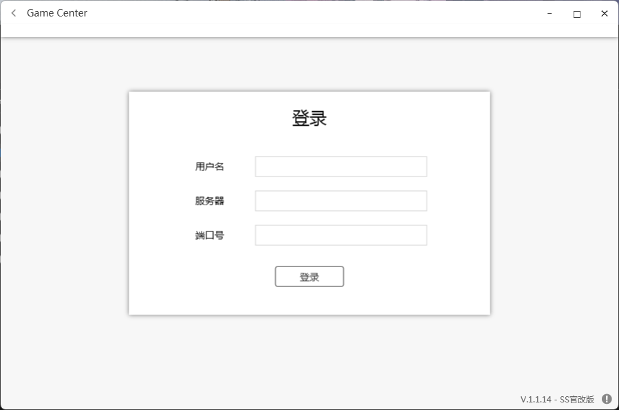

# GameCenter SS 魔改版
`注意：此版本 GameCenter 来自 fork 原库的早期版本，核心代码基本相同。`

## 魔改版

主要修改内容如下：
- 更扁平化的设计风格
- 单独的更新记录界面
- 对某 CK 的 [第三方服务端](https://github.com/M1k0t0/GameCenter-Server) 附加功能的支持
- IP/域名、端口输入框
- 自动保存上次填写的内容
- 回车键可以加入房间了（懒得动鼠标人大喜）
- 写了一半全是 BUG 的你画我猜（服务端也更新了功能）

## 使用方式
正式使用：将解决方案配置改为 Release；在代码中搜索 ClientIP，换为服务器的公网 IP；搜索 ServerIP，换为服务器的内网 IP。

本机测试：将解决方案配置改为 Debug；将 ClientIP 与 ServerIP 换为本机的内网 IP。

陈年代码了，谁感兴趣的话可以加一个 IP 输入框……

## 其他
来自 Mivik 的 GameCenter For Android 客户端

`注意：这个客户端还是半成品，如果你想继续完善它，欢迎修改。`
- [Github](github.com/Mivik/GameCenter)